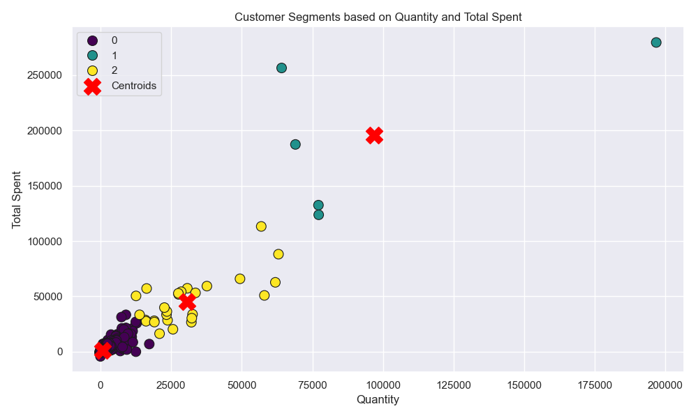

# Customer-Segmentation

Segment customers based on quantity and total amount spent using K-Means clustering.

\# 🧩 Customer Segmentation Using KMeans

\## 🧠 Project Summary

This project performs customer segmentation using transaction data from an online retail store. It analyzes customer behavior by calculating total spending and quantity purchased per customer, then applies \*\*KMeans clustering\*\* to group customers into distinct segments.

Key steps include:

\- Reading and cleaning data from an Excel file

\- Aggregating total spend and purchase quantity per customer

\- Scaling the data for effective clustering

\- Applying \*\*KMeans\*\* to identify customer segments

\- Visualizing the segments with scatter plots

\- Saving the results for further analysis

📊 This helps identify customer patterns such as high spenders, bulk buyers, and potential churners — useful for marketing, loyalty programs, or targeting campaigns.

\## 📊 Customer Segmentation Visualization

Here’s a visual representation of the customer clusters based on `Quantity` and `Total Spent`.

---

🧾 Customer Segmentation Project: Final Report
📌 Project Objective

The goal of this project is to segment retail customers based on their purchasing behavior using the RFM model (Recency, Frequency, Monetary) and apply K-Means clustering to uncover actionable customer groups. This helps marketing teams to tailor their strategies based on segment behavior.

✅ What's Been Improved
1. 🔄 Refactored and Modular Code

The improved version of the script (improvedsegmenter.py) includes clear structuring with meaningful sections:

Data loading & preparation

RFM feature engineering

Standardization

Clustering optimization

Final segmentation

Visualization

Output saving

2. 💾 Output Files Saved Automatically

All key outputs are saved to the data/ folder for easy access:

elbow_plot.png

silhouette_plot.png

rfm_segmentation.png

customers_segmented.csv

This makes the script production-ready and repeatable.

3. 📊 Enhanced Plotting

Matplotlib and Seaborn are used to generate high-quality visuals.

Plots are saved using plt.savefig() with plt.close() to prevent resource leakage.

4. 📂 Project Organization

All code is in src/improvedsegmenter.py

Outputs go into data/

Scripts and README added to support automation and documentation

5. 🔍 Improved User Feedback

Console print statements confirm every step and output file location.

Helpful error messages ensure issues like missing files are caught early.

🔢 RFM Model Overview
Metric	          Definition
Recency	          Days since the customer’s last purchase
Frequency	        Number of transactions (invoices) by the customer
Monetary	        Total amount spent by the customer

Each customer’s RFM score is computed and standardized to ensure balanced clustering.

📈 Plot Explanations
1. Elbow Method (elbow_plot.png)

Purpose: To identify the optimal number of clusters (k) by examining the inertia (sum of squared distances within clusters).

What to look for:

A “bend” or “elbow” in the plot.

This indicates diminishing returns in inertia reduction as k increases.

In this project:

The elbow appeared at k = 4, suggesting 4 is a good choice for cluster count.

2. Silhouette Score Plot (silhouette_plot.png)

Purpose: Measures how well samples are clustered — values range from -1 to 1 (higher is better).

What to look for:

Peaks indicate the most natural separation between clusters.

In this project:

k = 4 also had one of the highest silhouette scores, confirming the elbow method result.

3. Segment Scatterplot (rfm_segmentation.png)

Purpose: Visualizes the final customer segments in RFM space.

Axes:

X-axis: Recency (days since last purchase)

Y-axis: Monetary (total spend)

Colors: Each color represents a different customer segment.
Red 'X' markers represent cluster centroids.

Interpretation:

Customers in the bottom-right (low recency, high monetary) are likely high-value active customers.

Those in top-left are churned or low-value.

📊 Segment Summary (Example Output)

Segment Summary:
         Recency  Frequency Monetary           
                          mean     count
Segment                                
0         12.34      8.76   1032.56      250
1        153.20      2.12    345.09      620
2         45.67      4.56    478.23      430
3        205.10      1.20    187.00      700

🟢 Interpretation:

Segment 0 – Low recency, high frequency and monetary → likely loyal, high-value customers

Segment 3 – High recency, low values → at-risk or churned customers

🧠 Conclusions and Next Steps
📌 Key Takeaways:

4 customer segments discovered using RFM + K-Means

Clustering was validated using both Elbow and Silhouette methods

Insights can be used for personalized marketing or retention strategies

📈 Business Value:

Target Segment 0 for loyalty programs and upsells

Re-engage Segment 3 with win-back campaigns

Grow Segment 2 into higher spenders

🛠️ Future Enhancements

🧪 Use other clustering techniques (e.g., DBSCAN, Hierarchical)

🧠 Use PCA or t-SNE for better visualization

🧮 Automate RFM scoring tiers (e.g., High, Medium, Low)

📊 Build an interactive dashboard (e.g., with Streamlit)

📂 Files Produced
File	Description
data/elbow_plot.png	Shows optimal cluster number
data/silhouette_plot.png	Validates cluster separation
data/rfm_segmentation.png	Final customer segments visual
data/customers_segmented.csv	Full customer segmentation results

🧾 References

UCI Online Retail Dataset: https://archive.ics.uci.edu/ml/datasets/Online+Retail

RFM Segmentation: https://clevertap.com/blog/rfm-analysis/

K-Means Clustering: https://scikit-learn.org/stable/modules/clustering.html#k-means

✅ Final Notes

This project now provides:

Clean, modular, automated Python code

Data-driven visual insights

Easy reproduction through scripts and README

Ready to scale into a dashboard or production tool

\## 📁 Project Structure

